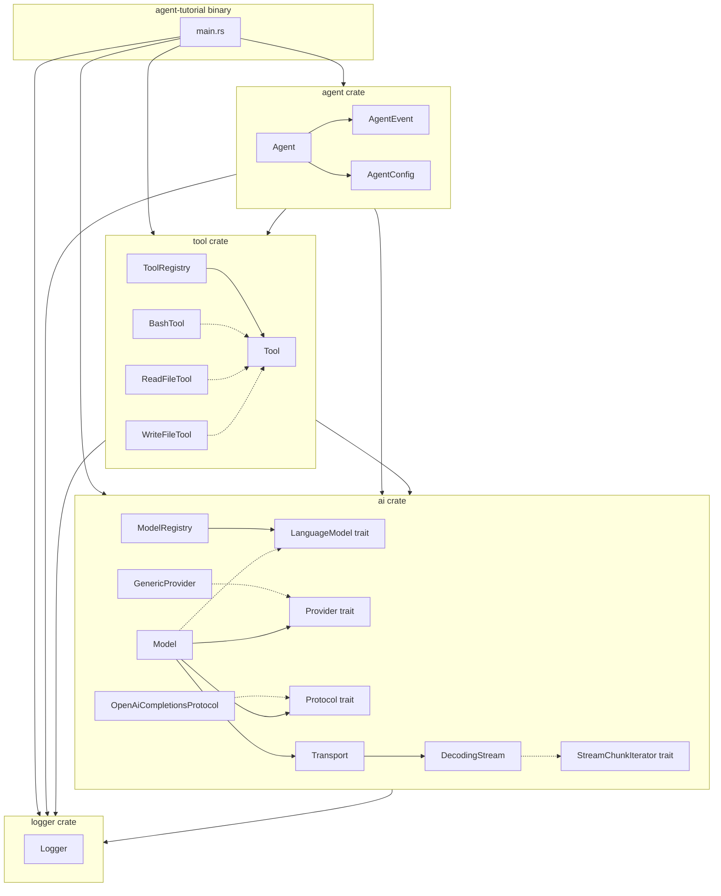

# CLAUDE.md

This file provides guidance to Claude Code (claude.ai/code) when working with code in this repository.

## Build & Test

```bash
cargo build              # 编译整个 workspace
cargo run                # 运行交互式 agent CLI
cargo test               # 运行所有 crate 的测试
cargo test -p tool       # 只跑 tool crate 的测试
cargo test -p tool bash  # 只跑 bash 模块的测试（按测试名过滤）
cargo fmt                # 格式化代码
cargo clippy             # Lint 检查
```

## Architecture

Cargo workspace 包含 4 个子 crate，由 `src/main.rs` 组装运行：

- **`ai`** — LLM 通信层,协议与供应商正交解耦为三层抽象:**Protocol**(纯 Codec,定义 `Protocol` trait,目前实现 `OpenAiCompletionsProtocol`,迁移自旧 DeepSeek)、**Transport**(通用 HTTP,不绑定任何协议/供应商)、**Provider**(供应商 = endpoint + 认证 + 支持协议,通用实现 `GenericProvider`)。由 **Model** 组合中枢(引用 Provider + 选定 Protocol + 共享 Transport + 采样/能力元数据)统一发起请求,`ModelRegistry` 以模型为单位注册查找。agent 经窄 trait **LanguageModel**(`stream_chat` + `model_id`)消费,不感知内部三层。数据模型 `Message`/`ToolCallRequest`/`ToolSpec`/`StreamChunk`/`Usage` 统一在此定义。新增协议 = 实现一个 `Protocol`;新增供应商 = 配一个 `GenericProvider`。
- **`agent`** — 核心 agent 循环：用户输入 → LLM 流式响应 → 如请求工具则通过 `ToolRegistry` 执行 → 将 tool result 追加到 history 回传 LLM → 循环直到 LLM 返回 `EndTurn`。通过 `AgentEvent` 枚举向调用方产出事件（Text/ToolRequest/ToolResponse/TurnEnd）。
- **`tool`** — 工具系统：`Tool` trait（name/description/parameters/execute）+ `ToolRegistry` 按名称注册和调度。内建三个工具：`BashTool`（含 10 类危险命令拦截）、`ReadFileTool`（支持行数截断）、`WriteFileTool`（自动创建父目录）。新增工具只需实现 `Tool` trait 并注册到 `ToolRegistry`。
- **`logger`** — 基于 `tracing` 的统一日志：控制台 human-readable（stderr）+ 文件 JSON（按天滚动到 `./logs/`）。`Logger::builder()` 初始化后返回 `WorkerGuard`，持有期间日志不会丢失。其余 crate 通过 `logger::{debug, info, error, warn}` 宏打日志。

## Environment

复制 `.env.example` 为 `.env`，填入 `DEEPSEEK_API_KEY`。`LOG_LEVEL` 环境变量控制日志级别（默认 `INFO`）。

## Architecture Diagram


